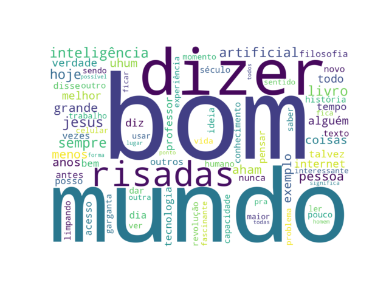

# 🎙️ Youtube video Word Cloud

Gera nuvens de palavras a partir da transcrição automática de vídeos do YouTube (podcasts, entrevistas, aulas), revelando os temas centrais discutidos sem a necessidade de assistir ao conteúdo inteiro.



## 💡 Sobre o projeto

Dado o link de um vídeo do YouTube, o programa busca a transcrição (legenda automática ou manual) diretamente da API interna do YouTube, processa o texto em português removendo palavras gramaticais e cacoetes de fala típicos de conteúdo falado, e gera uma visualização de nuvem de palavras ponderada por frequência.

## 🛠️ Tecnologias e bibliotecas

- **Python 3.12**
- [`youtube-transcript-api`](https://pypi.org/project/youtube-transcript-api/) — extração de transcrições do YouTube
- [`nltk`](https://www.nltk.org/) — corpus de stopwords em português
- [`wordcloud`](https://github.com/amueller/word_cloud) — geração da nuvem de palavras
- `matplotlib` — renderização da imagem final
- Módulos nativos: `re` (expressões regulares), `collections.Counter`, `urllib.parse`

## ⚙️ Como funciona (pipeline)

1. **Extração do ID do vídeo** a partir da URL do YouTube
2. **Busca da transcrição** via `youtube-transcript-api`
3. **Limpeza e tokenização** do texto:
   - normalização (minúsculas)
   - remoção de pontuação e caracteres não-alfabéticos via regex
   - remoção de stopwords (base NLTK + lista customizada de coloquialismos de fala transcrita, ex: "né", "tipo", "tá")
   - filtro de tokens muito curtos (fragmentos residuais de transcrição)
4. **Contagem de frequência** das palavras (`collections.Counter`)
5. **Geração da nuvem de palavras**, ponderada pela frequência de cada termo

## 🚀 Como rodar localmente

```bash
# Clone o repositório
git clone https://github.com/EduardoAPDias/podcast-wordcloud.git
cd podcast-wordcloud

# Crie e ative um ambiente virtual
python3 -m venv venv
source venv/bin/activate

# Instale as dependências
pip install -r requirements.txt

# Baixe o corpus de stopwords do NLTK (uma única vez)
python -c "import nltk; nltk.download('stopwords')"
```

Edite a variável `URL` em `main.py` com o link do vídeo desejado, e execute:

```bash
python main.py
```

## 🔭 Próximos passos

- [ ] Suporte a bigramas (expressões de duas palavras, como "bolsa família")
- [ ] Externalizar a lista de stopwords customizadas para um arquivo separado
- [ ] Opção de salvar a imagem gerada em arquivo, além de exibi-la
- [ ] Processamento de múltiplos vídeos em lote
